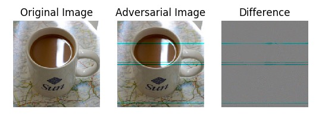
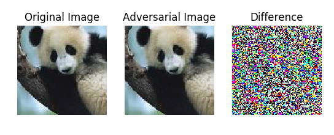

# Advbox

[中文版](advbox-ch.md)

Advbox is a toolbox to generate adversarial examples that fool neural networks in PaddlePaddle、PyTorch、Caffe2、MxNet、Keras、TensorFlow and Advbox can benchmark the robustness of machine learning models.

Advbox give a command line tool to generate adversarial examples with Zero-Coding.

## Supported attack and defense methods

### White-box attack  methods

- L-BFGS
- FGSM
- BIM
- ILCM
- MI-FGSM
- JSMA
- DeepFool
- C/W

### Black-box attack  methods

- Single Pixel Attack
- Local Search Attack

### Defense methods

- Feature Squeezing
- Spatial Smoothing
- Label Smoothing
- Gaussian Augmentation
- Adversarial Training
- Thermometer Encoding

###  Attack AI application

 - [Attack Face recognition ](applications/face_recognition_attack/README.md)

## Overview
[Szegedy et al.](https://arxiv.org/abs/1312.6199) discovered an intriguing properties of deep neural networks in the context of image classification for the first time. They showed that despite the state-of-the-art deep networks are surprisingly susceptible to adversarial attacks in the form of small perturbations to images that remain (almost) imperceptible to human vision system. These perturbations are found by optimizing the input to maximize the prediction error and the images modified by these perturbations are called as `adversarial examples`. The profound implications of these results triggered a wide interest of researchers in adversarial attacks and their defenses for deep learning in general.

# Setup

## Manual installation

For the most recent version of the library, either download the source code or clone the repository in your directory of choice and the sample code is in the tutorials directory.

	git clone https://github.com/baidu/AdvBox.git  

## Initialization Python environment

	pip install -r requirements.txt

# Documentation

##  Jupyter Notebook 

| Frame | Dataset | Model | Attack  method | Jupyter Notebook |
| ------ | ------ | ------ | ------ | ------ |
| MxNet | ImageNet2012 | AlexNet | FGSM | [link](ebook/ebook_imagenet_fgsm_mxnet.ipynb) |
| PyTorch | MNIST | CNN/MLP | FGSM | [link](ebook/ebook_mnist_fgsm_pytorch.ipynb) |
| PyTorch | ImageNet2012 | AlexNet | FGSM | [link](ebook/ebook_imagenet_fgsm_pytorch.ipynb) |
| PyTorch | ImageNet2012 | AlexNet | DeepFool | [link](ebook/ebook_imagenet_deepfool_pytorch.ipynb) |
| PyTorch | ImageNet2012 | AlexNet | JSMA | [link](ebook/ebook_imagenet_jsma_pytorch.ipynb) |
| Tensorflow | ImageNet2012 | Inception | FGSM | [link](ebook/ebook_imagenet_fgsm_tf.ipynb) |
| Tensorflow | ImageNet2012 | Inception | DeepFool | [link](ebook/ebook_imagenet_deepfool_tf.ipynb) |
| Tensorflow | ImageNet2012 | Inception | JSMA | [link](ebook/ebook_imagenet_jsma_tf.ipynb) |

## Zero-Coding tools example

Advbox give a command line tool to generate adversarial examples with Zero-Coding.

Take Tensorflow as an example, Tensorflow provides a rich [pre-training models](https://github.com/tensorflow/models),we attack image classification model squeezenet.

The GraphPipe-based prediction service is launched in the docker environment. The GraphPipe environment is fully encapsulated in the docker image, and does not need to be installed separately.

	docker run -it --rm \
	      -e https_proxy=${https_proxy} \
	      -p 9000:9000 \
	      sleepsonthefloor/graphpipe-tf:cpu \
	      --model=https://oracle.github.io/graphpipe/models/squeezenet.pb \
	      --listen=0.0.0.0:9000

If the network speed is limited, you can download squeezenet.pb and start it in local mode.

	docker run -it --rm \
	      -e https_proxy=${https_proxy} \
	      -v "$PWD:/models/"  \
	      -p 9000:9000 \
	      sleepsonthefloor/graphpipe-tf:cpu \
	      --model=/models/squeezenet.pb \
	      --listen=0.0.0.0:9000

Then run the attack script and use the default parameters, just specify the URL of your target. The current black box attack algorithm is LocalSearch.

	python advbox_tools.py -u http://your ip:9000

After the iteration attack, the attack results are shown in the following figure. The specific running time depends on the network speed. It is strongly recommended to start docker service on the local computer, which can greatly improve the attack speed.

	localsearch.py[line:293] INFO try 3 times  selected pixel indices:[ 0 23 24 25 26]
	localsearch.py[line:308] INFO adv_label=504 adv_label_pro=0.00148941285443
	localsearch.py[line:293] INFO try 4 times  selected pixel indices:[ 0 22 23 24 25]
	localsearch.py[line:308] INFO adv_label=463 adv_label_pro=0.00127408828121
	attack success, original_label=504, adversarial_label=463
	Save file :adversary_image.jpg
	LocalSearchAttack attack done. Cost time 100.435777187s

Taking [ONNX](https://onnx.ai/) as an example, Paddle Paddle, PyTorch, Caffe2, MxNet, CNTK and ScikitLearn all support saving the model into ONNX format. For files in ONNX format, start the docker environment with similar commands.

	docker run -it --rm \
	      -e https_proxy=${https_proxy} \
	      -p 9000:9000 \
	      sleepsonthefloor/graphpipe-onnx:cpu \
	      --value-inputs=https://oracle.github.io/graphpipe/models/squeezenet.value_inputs.json \
	      --model=https://oracle.github.io/graphpipe/models/squeezenet.onnx \
	      --listen=0.0.0.0:9000

advbox\_tools.py provides a lot of configuration parameters, in which the LocalSearch algorithm parameters can be set for reference.

	Usage: advbox_tools.py [options]	
	Options:
	  -h, --help            show this help message and exit
	  -u URL, --url=URL     graphpipe url [default: http://127.0.0.1:9000]
	  -m M, --model=M       Deep learning frame [default: onnx] ;must be in
	                        [onnx,tersorflow]
	  -R R, --rounds=R      An upper bound on the number of iterations [default:
	                        200]
	  -p P, --p-parameter=P
	                        Perturbation parameter that controls the pixel
	                        sensitivity estimation [default: 0.3]
	  -r R, --r-parameter=R
	                        Perturbation parameter that controls the cyclic
	                        perturbation;must be in [0, 2]
	  -d D, --d-parameter=D
	                        The half side length of the neighborhood square
	                        [default: 5]
	  -t T, --t-parameter=T
	                        The number of pixels perturbed at each round [default:
	                        5]
	  -i INPUT_FILE, --input-file=INPUT_FILE
	                        Original image file [default: mug227.png]
	  -o OUTPUT_FILE, --output-file=OUTPUT_FILE
	                        Adversary image file [default: adversary_image.jpg]
	  -c C, --channel_axis=C
	                        Channel_axis [default: 0] ;must be in 0,1,2,3

## Keras example

Code path is [Link](tutorials/keras_demo.py)

	#instantiate model
    keras.backend.set_learning_phase(0)
    model = ResNet50(weights=modulename)
    img = image.load_img(imagename, target_size=(224, 224))
    original_image = image.img_to_array(img)
    imagedata = np.expand_dims(original_image, axis=0)

Get ResNet50 logits layer as output.

	 #get logits layer
    logits=model.get_layer('fc1000').output
    # imagenet data normalizing std is 1， mean is [104, 116, 123]
    m = KerasModel(
        model,
        model.input,
        None,
        logits,
        None,
        bounds=(0, 255),
        channel_axis=3,
        preprocess=([104, 116, 123],1),
        featurefqueezing_bit_depth=8)

With non-targeted FGSM attack，epsilons is 1。
	
	attack = FGSM(m)
	attack_config = {"epsilons": 1, "epsilons_max": 10, "epsilon_steps": 1, "steps": 100}
	# fgsm non-targeted attack
	adversary = attack(adversary, **attack_config)

The result can be plotted like this
	
	adversary_image=np.copy(adversary.adversarial_example)
	#BGR -> RGB
	adversary_image=adversary_image[:,:,::-1]
	adversary_image = np.array(adversary_image).reshape([224,224,3])
	original_image=np.array(original_image).reshape([224, 224, 3])
	show_images_diff(original_image,adversary_image)

   

## PaddlePaddle example
[Link](paddle.md)

# Issues report
	
[Link](https://github.com/baidu/AdvBox/issues)

# License

AdvBox support [Apache License 2.0](https://github.com/baidu/AdvBox/blob/master/LICENSE)

# Authors

- Baidu xlab

# Reference

- http://www.paddlepaddle.org/docs/develop/documentation/en/build_and_install/pip_install_en.html
- http://paddlepaddle.org/docs/0.14.0/documentation/fluid/zh/new_docs/beginners_guide/install/install_doc.html
- https://github.com/PaddlePaddle/models/tree/develop/fluid/adversarial
- [Intriguing properties of neural networks](https://arxiv.org/abs/1312.6199), C. Szegedy et al., arxiv 2014
- [Explaining and Harnessing Adversarial Examples](https://arxiv.org/abs/1412.6572), I. Goodfellow et al., ICLR 2015
- [Adversarial Examples In The Physical World](https://arxiv.org/pdf/1607.02533v3.pdf), A. Kurakin et al., ICLR workshop 2017
- [Boosting Adversarial Attacks with Momentum](https://arxiv.org/abs/1710.06081), Yinpeng Dong et al., arxiv 2018
- [The Limitations of Deep Learning in Adversarial Settings](https://arxiv.org/abs/1511.07528), N. Papernot et al., ESSP 2016
- [DeepFool: a simple and accurate method to fool deep neural networks](https://arxiv.org/abs/1511.04599), S. Moosavi-Dezfooli et al., CVPR 2016
- [Foolbox: A Python toolbox to benchmark the robustness of machine learning models](https://arxiv.org/abs/1707.04131), Jonas Rauber et al., arxiv 2018
- [CleverHans: An adversarial example library for constructing attacks, building defenses, and benchmarking both](https://github.com/tensorflow/cleverhans#setting-up-cleverhans)
- [Threat of Adversarial Attacks on Deep Learning in Computer Vision: A Survey](https://arxiv.org/abs/1801.00553), Naveed Akhtar, Ajmal Mian, arxiv 2018

# How to Cite

If you instead use AdvBox in an academic publication, cite as:

	@misc{advbox,
	 author= {Dou Goodman,Wang Yang,Hao Xin},
	 title = {Advbox:a toolbox to generate adversarial examples that fool neural networks},
	 month = mar,
	 year  = 2019,
	 url   = {https://github.com/baidu/AdvBox}
	}
