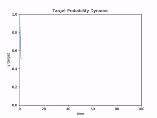
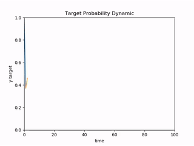

# ODD(Object Detector Deception)

### 1. Introduction 

#### Purpose

Hello researchers and geeks,

ODD is a tool-box for attacking object detectors with mainstream attack methods. It provides users with convenience on doing experiment and benchmark. Users can place modified OD model and customize attack cost function according to attack goal in the framework.

For now, ODD only has a yolo(faster-yolo v2) model to play with. We welcome contributions for more models and attack methods to go onto the stage.

Best!

#### Results

gif:  链接: https://pan.baidu.com/s/1SBwsJExomcWgBQnN8ZR1SA 提取码: wuu5

<table>
    <tr>
        <td >

</td>
        <td >

</td>
    </tr>
    <td >
Original
</td>
    <td >
Improved
</td>
    <tr>
        <td >

</td>
        <td >

</td>
    </tr>
    <td >
Original-physical
</td>
    <td >
Improved-physica
</td>
    
</table>

<td >
Demo
</td>

#### Explanation

- [COMMSEC: Hacking Object Detectors Is Just Like Training Neural Networks. HITB GSEC 2019](https://gsec.hitb.org/sg2019/sessions/commsec-hacking-object-detectors-is-just-like-training-neural-networks/)
- [Recorded Video from 6:00:00](https://www.youtube.com/watch?v=MGc_KskTnF4)

### 2. Install

(1) git clone https://github.com/advboxes/AdvBox.git

(2) Download weights file from https://drive.google.com/file/d/0B2JbaJSrWLpza0FtQlc3ejhMTTA/view?usp=sharing

(3) Put weights file under `./weights`

### 3. Usage Example

Note:

User can use [labelImg](https://github.com/tzutalin/labelImg) to specify adversarial perturbed area. If use EOT(Expectation over Transformation), remember adjust eot parameters before generating ad-sticker.

For target attack, load data_sampling folder with target samples first.

(1) Entering `AdvBox/advbox_family/ODD`

(2) Run command:
    `python attack_model.py -fromfile data_sampling -frommaskfile test/EOTB.xml`

(3) Tuning the hyperparameter `self.punishment` and `attack steps` to control the optimization of the target.

(4) See source code under `./attack_methods/` for more attack option.

(5) When meeting the end condition, the program will save the adversary example will in `./result`.

### 4. Requirements

- TensorFlow
- Opencv3

### 5. Citation

If you use ODD for academic research, you are highly encouraged (though not required) to cite the following :

    @misc{advbox,
     author= {Baidu X-lab},
     title = {Advbox:a toolbox to generate adversarial examples that fool neural networks},
     month = mar,
     year  = 2019,
     url   = {https://github.com/baidu/AdvBox}
    }

### 6. Changelog

2019/07/08 : New Release!

2019/09/05 : Clear Redundancy.

### 7. References:

[0]. Synthesizing Robust Adversarial Examples. https://arxiv.org/abs/1707.07397. Anish Athalye 2017.

[1]. Adversarial Patch. https://arxiv.org/abs/1712.09665. TB Brown 2017.

[2]. Building-Towards-Invisible-Cloak_compressed. http://gixnetwork.org/wp-content/uploads/2018/12/Building-Towards-Invisible-Cloak_compressed.pdf. Darren Y 2018.

[3]. The object detection code & paper is originally from : http://pjreddie.com/darknet/yolo/

[4]. The code we used here is a tensorflow implementation from : https://github.com/gliese581gg/YOLO_tensorflow

[5]. On Physical Adversarial Patches for Object Detection. https://arxiv.org/abs/1906.11897. Mark Lee, Zico Kolter 2019.

[6]. Fooling automated surveillance cameras: adversarial patches to attack person detection. https://arxiv.org/abs/1904.08653. Simen Thys, Wiebe Van Ranst, Toon Goedemé 2019.

[7]. Fooling Detection Alone is Not Enough: First Adversarial Attack against Multiple Object Tracking. https://arxiv.org/abs/1905.11026. Jia Y 2019.
