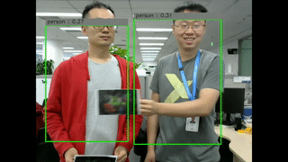

# Stealth T-shirt
### 1. Introduction 
#### Purpose

To raise people's awareness of techniques that can deceive deep learning models, we designed this "Stealth T-shirt" with the adversarial pattern to fool an object detector. The T-shirt is capable of hiding a person who wears it from an open-source object detector.

#### What is this?

This a T-shirt with adversarial pattern printed on the chest capable of fooling an object detector. The adversarial pattern is generated via known gradients of the model.

#### How does it work?

By wearing it and showing the adversarial pattern in front of a camera and its object detector behind it, the person who wears it disappears, whereas the person who doesn't wear the T-shirt is still under object detector detection.

#### Thanks

The attacking method from : http://gixnetwork.org/wp-content/uploads/2018/12/Building-Towards-Invisible-Cloak_compressed.pdf

The object detection code & paper is originally from : http://pjreddie.com/darknet/yolo/

The code we used here is a tensorflow implementation from : https://github.com/gliese581gg/YOLO_tensorflow

### 2. Install

(1) git clone https://github.com/baidu/AdvBox

(2) Download weight from

Baidu : https://pan.baidu.com/s/13bhF5lTtADdi2DLHE-Qvfg (extraction code: 8dsh)

Google : https://drive.google.com/file/d/0B2JbaJSrWLpza0FtQlc3ejhMTTA/view?usp=sharing

### 3. Usage

(1) Entering `./applications/StealthTshirt`

(2) Run `python StealthTshirtDemo.py`

(3) Try to hind yourself from object detector. `Find the best angle or posture to lower the detection confidence.`

### 4. Requirements

- TensorFlow
- Opencv3

### 5. Changelog

2019/05/24 : First upload!

2019/05/31 : Upload sticker and test gif.

