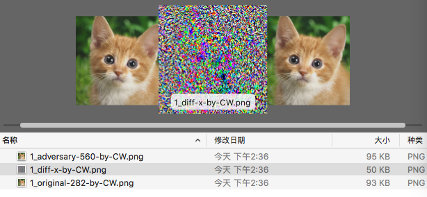

# Example
## AdvBox对抗样本生成简例
可对任意图片基于白盒模型进行对抗样本生成  
该简例提供了resnet、alexnet的模型，以及其对imagenet的训练参数，可放置任意图片进行对抗样本生成。target方式还可指定生成样本的可信度。  
提供如下攻击算法的实例：
- FGSM (no target)
- CW (target)
## 结构分布
	example
	├── images
	│   ├── cat_example.png
	│   └── mytest_list.txt
	├── models
	│   ├── alexnet.py
	│   ├── __init__.py
	│   └── resnet.py
	├── parameters
	│   ├── alexnet
	│   └── resnet_50
	├── imagenet_example_cw.py
	├── imagenet_example_fgsm.py
	├── reader.py
	└── utility.py

例子中包括几部分：  
images目录：放置被攻击的原始图片，可以是多张。mytest_list.txt中记录了需要进行样本生成的该图片名称  
models目录：模型文件  
parameters目录：需要下载，用于models内模型的训练参数  
imagenet_example_cw.py：用例应用主文件，使用CW攻击算法，当前仅支持target方式  
imagenet_example_fgsm.py：用例应用主文件，使用FGSM攻击算法，当前仅支持非target方式  
reader.py：读取原始图片处理  
utility.py：命令行参数及输出处理  

## 测试应用
### 下载模型和参数
本例中已提供[resnet](http://paddle-imagenet-models.bj.bcebos.com/alexnet_model.tar)、[alexnet](http://paddle-imagenet-models.bj.bcebos.com/resnet_50_model.tar)的模型及其预训练参数下载，也可以另行下载任意模型，但需要按要求进行修改调整（参见：特别提示）  
模型文件放入

	example/models/
训练参数文件放入

	example/parameters/
### 下载攻击图片
图片放入

	example/images/
更新图片配置文件

	example/images/mytest_list.txt
	将所有需要攻击的图片名称加入其中
### 执行攻击
输入命令

	python imagenet_example_cw.py  --log_debug=True --target=560
	具体参数
	--use_gpu:(BOOL) 是否使用GPU
	--class_dim:(INT) 输出类别个数
	--image_shape:(STR) 输入数据形状
	--pretrained_model:(STR) 模型参数路径
	--model:(STR) 模型指定
	--target:(INT) 指定target的分类，不指定为非target方式
	--log_debug:(BOOL) 是否开启调试
	--inference:(BOOL) 是否仅做预测，不生成对抗样本
	注：可信度没有提供成参数，需要在代码中指定，名称confidence_level，畎认设置为0.9，表示90%可信度

执行输出

	root:/AdvBox/example# python imagenet_example_cw.py --use_gpu=True --log_debug=True --target=560
	-----------  Configuration Arguments -----------
	batch_size: 256
	class_dim: 1000
	image_shape: 3,224,224
	inference: False
	log_debug: False
	model: ResNet50
	pretrained_model: ./parameters/resnet_50/115
	target: 560
	use_gpu: 1
	------------------------------------------------
	--------------------inference-------------------
	Test-0-score: 0.380188554525, class 282, name=./images/cat_example.png
	--------------------adversary-------------------
	guess img before preprocess:282  expect:560
	Checking if 10.000000 is a successful c.
	label:560 softmax:0.980241060257 L2:1338.22021484
	Checking if 5.005000 is a successful c.
	label:560 softmax:0.990494728088 L2:463.381530762
	Checking if 2.507500 is a successful c.
	label:560 softmax:0.921321153641 L2:183.302642822
	Checking if 1.258750 is a successful c.
	label:560 softmax:0.90595304966 L2:90.1555404663
	Checking if 0.634375 is a unsuccessful c.
	Checking if 0.946562 is a unsuccessful c.
	Checking if 1.102656 is a unsuccessful c.
	predict label: 560 softmax: 0.90595305
	attack success, original_label=282, adversarial_label=560, count=1
	--------------------------------------------------
	cw attack done

对原图片cat_example.png生成的对抗样本保存在./output目录下

	1_adversary-560-by-CW.png  1_diff-x-by-CW.png  1_original-282-by-CW.png
adv字样的为攻击样本，diff为在原图中扰动的部分，orig为原图

## 样本效果

验证样本的实际效果，可以先将输出的样本拷贝到images目录下,在mytest_list.txt中增加这个图片名称

	cp .output/imagenet/1_adversary-560-by-CW.png ./images/
	vi ./images/mytest_list.txt

再次以inference方式运行example

	root:/AdvBox/example# python imagenet_example_cw.py --use_gpu=True --inference=True
	
	-----------  Configuration Arguments -----------
	batch_size: 256
	class_dim: 1000
	image_shape: 3,224,224
	inference: 1
	log_debug: False
	model: ResNet50
	pretrained_model: ./parameters/resnet_50/115
	target: 560
	use_gpu: 1
	------------------------------------------------
	--------------------inference-------------------
	Test-0-score: 0.380188554525, class 282, name=./images/cat_example.png
	Test-1-score: 0.903945684433, class 560, name=./images/1_adversary-560-by-CW.png

### 显示图片结果

## 特别提示

- 关于CW算法的使用：  
1、因为该算法需要在IMG数据前进行一系列的计算，当前paddle又无法使用非Data的占位符，所以model要一起被带入CW中执行  
2、已经训练好的参数如果只想导入一次，需要在model内对每个conv2d、bn、fc等参数位置指定名称，这样在主进程导入时，可以只导一次，并提供给CW和主框架同时使用  
3、应用主进程内，创建攻击类要提前，导入参数要放置在最后  

- 原始图片相关  
本例中仅生成大小为224*224的攻击样本，会对原始图片进行缩放和裁剪，所以输出并不是原图比例

- 使用GPU运行  
如果需要使用GPU，命令行需要加--use_gpu=True ，另外还要提前设置环境变量export WITH_GPU=1

